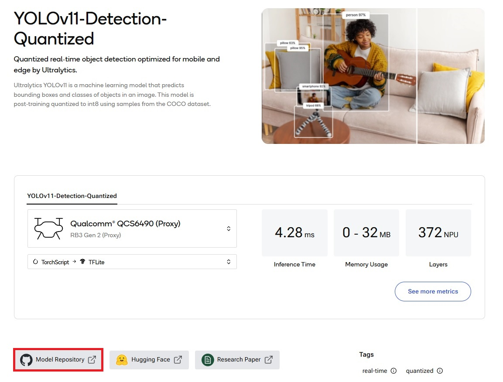

# qai-hub-Environment-Setup-Command-History
Last update: 2025/3/14

## ⚠ Disclaimer

This repository contains personal development notes based on **publicly available information** from:
- **Qualcomm official website**: [Qualcomm AI Hub](https://aihub.qualcomm.com/)
- **Qualcomm official documentation**
- **Qualcomm Support Forum** responses from official representatives

🚀 **This repository does NOT contain any confidential Qualcomm materials, proprietary SDKs, or unpublished APIs.**


## qai-hub Module versions
qai-hub 0.25.0

qai-hub-models 0.25.2 (2025/3/14)

## Environment setup
It's highly recommended that you setup a clean environment using things like miniconda or Virtualenv. Here I'll use miniconda.
### miniconda environment creation
You can specify the Python version, ranging from 3.9 to 3.13, and the name of the environment is up to you.
```
conda create -n qaihub_py311 python=3.11
conda activate qaihub_py311
```

### pip update

Remember to update pip before going further. Otherwise, you may unexpectedly install the older versions of qai-hub modules.
```sh
pip install --upgrade pip setuptools wheel
```

### Installation and configuration of qai-hub
Visit [Qualcomm AI Hub](https://aihub.qualcomm.com/) (Right-click to open in a new tab) and log in.

Go to **Settings** and check **Getting started**, where you should see the following:


Copy the following content and execute it to both install and configure qai-hub.

```
pip install qai-hub
qai-hub configure --api_token (YOUR_TOKEN)
```

### qai-hub-models installation
You may install qai-hub-models by yourself or directly install additional dependencies required for some models such as YOLOv11, because qai-hub-models will be automatically installed as well.
```
pip install qai-hub-models
```

or 

```
pip install --no-cache-dir "qai-hub-models[yolov11-det-quantized]"
```

## Model export

### Export
You can download most models directly from Qualcomm AI Hub, but there are exceptions.

Some models such as [YOLOv11-Detection-Quantized](https://aihub.qualcomm.com/models/yolov11_det_quantized) can't be downloaded from there due to some licensing constraints, so you don't see the **Download model** button there. Instead, press the **Model Repository** button and you should see check the **Example & Usage** section, where you will see the command that was mentioned before.



```
pip install "qai-hub-models[yolov11-det-quantized]"
```
After the dependency installation, run the folllowing command:

```
python -m qai_hub_models.models.yolov11_det_quantized.export
```
The whole process would first git clone ultralytics and download the yolov11n.pt to path /root/.qaihm/models and COCO dataset to path /root/.qaihm/fiftyone in your device.

The downloaded .pt model will then be uploaded to Qualcomm AI Hub, where **compiling**, **quantization** (if necessary), **profiling**, and **inference** of the uploaded model will be executed. You can check the details of those tasks on https://app.aihub.qualcomm.com/jobs/ as shown in the picture below.


After all the tasks above have been done, a TensorFlow Lite (.tflite) model will be downloaded to your current CLI position in your device. A folder named **build** would be created and you can see the quantized model there.

If you want to export a QNN (.bin) model, you need to add additional arguments. Run the following command to check the details:

```
python -m qai_hub_models.models.yolov11_det_quantized.export --help
```


We didn't specify the target runtime so by default a .tflite model will be compiled and downloaded. To download a QNN model, --target-runtime and --chipset arguments are required.

You can see the supported chipsets from the help command mentioned above. Here we take QCS6490 for example.

```
python -m qai_hub_models.models.yolov11_det_quantized.export --target-runtime qnn --chipset qualcomm-qcs6490-proxy
```
It will literally follow the same procedure and finally download a .bin model to your current CLI position.

### Problems encountered
The steps mentioned above helps download certain models, but still don't really work on lots of models due to some different reasons such as lacking certain dependencies such as aimet-torch. This problem still needs to be mentioned in the support forum in the future.

#### `UnicodeDecodeError: 'cp950'` Issue

If you run the above export command on Traditional Chinese Windows, you may encounter the following error:

````plaintext
File "C:\Users\user\miniconda3\envs\qaihub_py311\Lib\site-packages\qai_hub_models\models\yolov11_det_quantized\model.py", line 23, in from_pretrained
    return super().from_pretrained(
           ^^^^^^^^^^^^^^^^^^^^^^^^
  File "C:\Users\user\miniconda3\envs\qaihub_py311\Lib\site-packages\qai_hub_models\models\yolov11_det\model.py", line 63, in from_pretrained
    find_replace_in_repo(
  File "C:\Users\user\miniconda3\envs\qaihub_py311\Lib\site-packages\qai_hub_models\utils\asset_loaders.py", line 371, in find_replace_in_repo
    for line in file:
  File "C:\Users\user\miniconda3\envs\qaihub_py311\Lib\fileinput.py", line 251, in __next__
    line = self._readline()
           ^^^^^^^^^^^^^^^^
  File "C:\Users\user\miniconda3\envs\qaihub_py311\Lib\fileinput.py", line 372, in _readline
    return self._readline()
           ^^^^^^^^^^^^^^^^
UnicodeDecodeError: 'cp950' codec can't decode byte 0xf0 in position 19: illegal multibyte sequence
````

##### Solution
Open qai_hub_models\utils\asset_loaders.py and jump to line 371, where you should see the following code snippet:

```py
    with fileinput.FileInput(
        Path(repo_path) / filepath,
        inplace=True,
        backup=".bak",
    ) as file:
```

Add **encoding="utf-8"** to FileInput() as an argument so that it becomes:

``` py
    with fileinput.FileInput(
        Path(repo_path) / filepath,
        inplace=True,
        backup=".bak",
        encoding="utf-8",
    ) as file:
```

## Others

### Important paths
When attempting to download a model via an export command, additional elements such as the raw model(i.e, yolov11n.pt) and some training data(i.e, COCO dataset) may also be downloaded first and they will be located in the .qaihm folder.

#### Linux
```plaintext
/root/.qaihm
```


## References

[AI Hub Models](https://github.com/quic/ai-hub-models/)

[Qualcomm AI Hub](https://aihub.qualcomm.com/)

[Qualcomm AI Hub documentation](https://app.aihub.qualcomm.com/docs/index.html)
